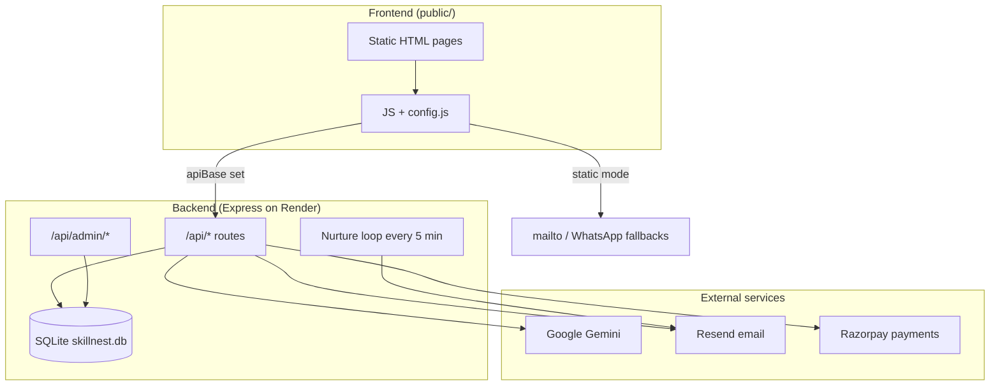

# VidyaOps — Project Context

> Context document for the VidyaOps website, local workspace, GitHub repo, and deployment setup.  
> Last reviewed: June 2026

---

## Overview

**VidyaOps** is a Pune-based tech training brand with the tagline *"Knowledge is the power."* It offers practical learning in Cloud, Data Analysis, AI, and Cybersecurity for college students, freshers, early professionals, and knowledge seekers.

| Item | Detail |
|------|--------|
| **Live site** | [https://vidyaops.com](https://vidyaops.com) |
| **GitHub repo** | [https://github.com/nileshdgaikwad8805/vidyaops.git](https://github.com/nileshdgaikwad8805/vidyaops.git) |
| **Local workspace** | `C:\Users\niles\Downloads\VidyaOps\LearnSkills` |
| **App package name** | `vidyaops-site` |
| **Contact** | 9284543320 · contact@vidyaops.com |

---

## Local Workspace

The folder `LearnSkills` is a **mixed workspace** containing two largely separate projects:

| Project | Stack | Purpose |
|---------|-------|---------|
| **VidyaOps site** (primary) | Node.js + Express 5, static HTML/CSS/JS | Marketing site, admin dashboard, APIs, payments, chatbot |
| **Job Finding AI Agent** (secondary) | Python (`main.py`, `requirements.txt`) | Job discovery/filtering tool — **not** part of the live website |

The VidyaOps website code is the Node.js application tied to the **vidyaops** Git remote.

---

## Git Remotes & Branch

| Remote | URL |
|--------|-----|
| `origin` | `https://github.com/nileshdgaikwad8805/SkillNest.git` |
| `vidyaops` | `https://github.com/nileshdgaikwad8805/vidyaops.git` |

- **Current branch:** `codex/render-deploy-prep`
- **Tracks:** `vidyaops/main`

---

## Repository Structure

```text
LearnSkills/
├── server.js                 # Entry: loads .env, DB, seeds, starts Express
├── app-config.js             # Env-driven config (platform, runtime, DB, APIs)
├── package.json              # "vidyaops-site"
├── render.yaml               # Render deployment (backend + persistent disk)
├── vercel.json               # Vercel static frontend build
├── netlify.toml              # Alternative static host
├── DEPLOYMENT.md             # Deployment guide
├── config.js                 # Generated runtime frontend config (root)
├── public/                   # Static marketing pages + admin UI
│   ├── index.html, about.html, workshops.html, enroll.html, ...
│   ├── js/script.js          # Chatbot, contact form, navigation
│   ├── js/workshops.js, enroll.js, admin.js, ...
│   └── config.js             # Runtime frontend config (served statically)
├── src/
│   ├── app.js                # Express app, CORS, static files, /config.js route
│   ├── routes/               # /api/* and /api/admin/*
│   ├── controllers/          # Public, admin, workshop, volunteer, content
│   ├── services/             # Gemini, email (Resend), Razorpay, nurture jobs
│   └── db/                   # SQLite schema + seeds
├── scripts/generate-config.js  # Vercel build: writes config.js
├── data/                     # SQLite DB + uploads (Render disk mount)
└── reports/                  # Internal fix/change notes
```

---

## Architecture



### Frontend runtime modes

Configured via `window.VIDYAOPS_CONFIG` in `config.js`:

| Mode | Behavior |
|------|----------|
| **`static`** + empty `apiBase` | No backend calls; email, WhatsApp, and local chatbot fallbacks |
| **`apiBase` set** | Frontend calls a separate backend (e.g. Render) |

Example generated config:

```js
window.VIDYAOPS_CONFIG = window.VIDYAOPS_CONFIG || {
  "apiBase": "",
  "runtimeMode": "static",
  "platformTarget": "vercel"
};
```

---

## Features

### Public pages

Home, About, Services, Corporate Training, Certifications, Programs, Workshops, Contact, Enroll, Volunteer, Learner Dashboard, Payment Success, Admin Login

### Public API (`/api/*`)

| Endpoint | Purpose |
|----------|---------|
| `GET /api/workshops` | Workshop listings |
| `GET /api/products` | Enrollment product catalog |
| `GET /api/content` | Editable site content |
| `GET /api/learner/session` | Learner dashboard session |
| `POST /api/chat` | Gemini-powered chatbot |
| `POST /api/contact` | Contact form inquiries |
| `POST /api/leads` | Lead capture |
| `POST /api/enrollments/free` | Free enrollment |
| `POST /api/payments/razorpay/order` | Create Razorpay order |
| `POST /api/payments/razorpay/verify` | Verify Razorpay payment |
| `POST /api/volunteer/apply` | Volunteer trainer applications |
| `GET /api/health` | Health check |

### Admin (`/admin-login.html` → `/admin.html`)

- Workshop CRUD
- Lead/inquiry management & CSV export
- AI content generation (Gemini)
- Site content editing
- Test email via Resend
- Password change

### Database (SQLite — `data/skillnest.db`)

| Table | Purpose |
|-------|---------|
| `contact_inquiries` | Contact form submissions + AI/nurture fields |
| `chatbot_leads` | Chatbot lead capture |
| `chat_messages` | Chat session history |
| `workshops` | Workshop catalog |
| `enrollments` | Free & paid enrollments |
| `volunteer_trainers` | Volunteer applications |
| `site_content` | CMS-style editable page content |
| `admin_users` | Admin authentication |

### Background jobs

- **Nurture email cycle** runs every 5 minutes on long-running hosts (Render)
- Disabled on serverless runtimes (Vercel)
- Uses Resend for automated follow-ups

---

## External Integrations

| Service | Use |
|---------|-----|
| **Google Gemini** | Chatbot, lead/inquiry AI scoring, content generation |
| **Resend** | Transactional & nurture emails |
| **Razorpay** | Paid workshop/program enrollment |

---

## Deployment

### Split deployment model

| Platform | Role | Notes |
|----------|------|-------|
| **Render** | Full backend | Node server, SQLite, background jobs, persistent disk |
| **Vercel** | Static frontend | Builds `config.js`, serves `public/` pages |
| **Netlify** | Alternative frontend | Supported via `netlify.toml` |

> **Recommended production setup:** Vercel (frontend) + Render (backend)

### Render (`render.yaml`)

- Service name: `vidyaops-app`
- Build: `npm install`
- Start: `npm start` → `server.js`
- Health check: `/api/health`
- **Persistent disk:** 1 GB at `/opt/render/project/src/data` for SQLite

Key env vars:

```env
PLATFORM_TARGET=render
SERVER_RUNTIME_MODE=long-running
ENABLE_BACKGROUND_JOBS=true
GEMINI_API_KEY=...
ADMIN_USERNAME=...
ADMIN_PASSWORD=...
RESEND_API_KEY=...
RESEND_FROM_EMAIL=VidyaOps <onboarding@resend.dev>
NOTIFY_EMAIL_TO=contact@vidyaops.com
RAZORPAY_KEY_ID=...
RAZORPAY_KEY_SECRET=...
ALLOWED_ORIGINS=https://vidyaops.com,https://your-render-domain.onrender.com
DATA_DIR=./data
```

### Vercel (`vercel.json`)

- Build command: `npm run build:vercel`
- Generates `config.js` and `public/config.js` from env vars
- Serves static frontend with security headers

Key env vars:

```env
PUBLIC_API_BASE=https://your-render-backend.onrender.com
PUBLIC_RUNTIME_MODE=static
PUBLIC_PLATFORM_TARGET=vercel
```

On the backend (Render), set `ALLOWED_ORIGINS` to include the Vercel/frontend domain.

### Why not full-stack on Vercel?

- SQLite needs persistent storage (Render disk)
- Background nurture jobs use `setInterval` (not suitable for Vercel serverless)
- Vercel is configured for **static frontend deployment**, not the full Node + SQLite backend

---

## Live Site State (as of June 2026)

Observed on production:

- `https://vidyaops.com/api/health` → **404**
- Suggests **vidyaops.com is currently frontend-only** (likely Vercel) without the Render backend wired via `PUBLIC_API_BASE`

Recent local fixes (see `reports/vidyaops-site-fixes-2026-06-19.md`):

- Added `public/config.js` for static deployments
- Static fallbacks for workshops, enrollment, contact, chatbot when APIs are missing
- Removed draft/internal copy from HTML pages
- **Pending:** Redeploy to reflect fixes on vidyaops.com

---

## Open Decisions

1. **Static-only** — Keep vidyaops.com on Vercel with email/WhatsApp fallbacks (current-ish state)
2. **Full stack** — Point Vercel frontend at Render backend via `PUBLIC_API_BASE` for live contact forms, payments, chatbot, and admin

Additional suggested work:

- Review Services vs Programs page overlap
- Configure production env vars and redeploy recent fixes
- Verify Resend domain for production email sending

---

## Quick Reference Commands

```powershell
# Local development
cd C:\Users\niles\Downloads\VidyaOps\LearnSkills
npm install
npm start
# → http://127.0.0.1:3000

# Vercel build (generates config.js)
npm run build:vercel

# Health check (when backend is running)
# http://127.0.0.1:3000/api/health

# Admin
# http://127.0.0.1:3000/admin-login.html
```

---

## Related Files

| File | Description |
|------|-------------|
| `DEPLOYMENT.md` | Full deployment guide |
| `reports/vidyaops-site-fixes-2026-06-19.md` | Recent production fix log |
| `.env.example` | All supported environment variables |
| `app-config.js` | Central config loader |
